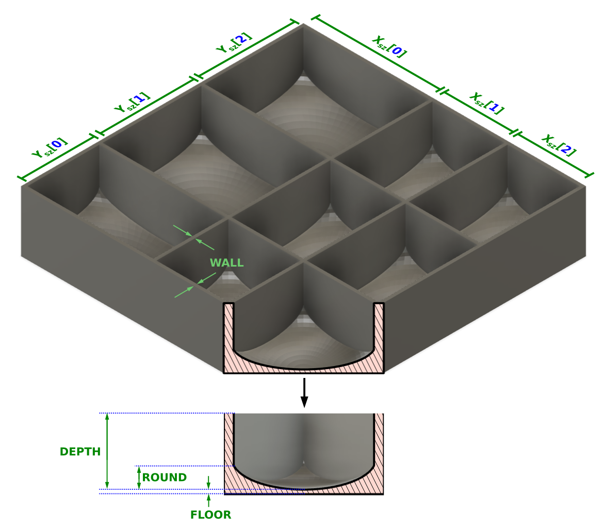

### Create 3D-Printable Organizer Trays with Rounded Bin Floors

This project uses OpenSCAD and SolidPython to dynamically generate 3D-printable organizer trays with rounded floors (for ease of removing small things with your fingers).  It can be run locally in Python, or you can use the pre-built docker image:

* etotheipi/3dprint-tray-gen:latest

At the time this was written, I also operated a server hosted on AWS that will run the script for you and allow you to download the .STL files.

* https://traygen.alanreiner.com

Here is a diagram showing how the tray can be customized:



-----

## Running the Script Locally

The two primary options for running this script are 

* Linux command-line with Python3 environment (not tested on Windows or Mac)
* Using the prebuilt Docker image that is in Docker Hub (should work on any OS that has Docker installed)


### Linux Command-Line

Prerequisites - Git pull this project or download it as a zipfile and unpack it.  The commands below will create a virtual Python3 environment and install the prerequisites into it.
```
# From within the project directory

$ sudo apt install openscad python3-venv
$ python3 -m venv traygen_env
$ source traygen_env/bin/activate
$ pip install -r requirements.txt
```
 
After that, you can run the script with `--help` to see the available options:

```
$ python generate_tray.py --help
...
```

Here's an example tray that leverages nearly all options:
```
$ python3 generate_tray.py \
   [30, 40, 75] \
   [20, 30, 45] \
   --depth 25.0 \
   --wall 1.8 \
   --floor 1.8 \
   --round 12.0
```

By default, all units are in millimeters.  You can specify in inches if you add `--inches` to the above command.

The output of the script with be stored in the directory `<project>/output_trays/`


### Docker

The prebuilt docker images are fully contained and can be run immediately if you have Docker installed.  It will automatically pull the image from Dockerhub and run it locally.  The `-v` flag tells Docker to mount the current directory as `/mnt` inside the container, which is where it writes out the final model files.  Without this flag, the files will be written to the ephemeral disk inside the container, which disappears when the script is finished running.

The docker image is designed
```
$ docker run -it -v `pwd`:/mnt etotheipi/3dprint-tray-gen:latest \
   [30, 40, 75] \
   [20, 30, 45] \
   --depth 25.0 \
   --wall 1.8 \
   --floor 1.8 \
   --round 12.0
```

If you are in Linux or Mac and expect to use this regularly, you can add a line to your `~/.bashrc` or `~/.bash_profile` to replace the first line:

```
# Put this at the end of your ~/.bashrc or ~/.bash_profile
alias gentray='sudo docker run -it -v `pwd`:/mnt etotheipi/3dprint-tray-gen:latest'
```

Then to use the script you replace the first line with `gentray`
```
$ gentray \
   [30, 40, 75] \
   [20, 30, 45] \
   --depth 25.0 \
   --wall 1.8 \
   --floor 1.8 \
   --round 12.0
```
